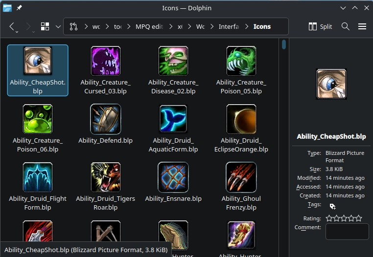
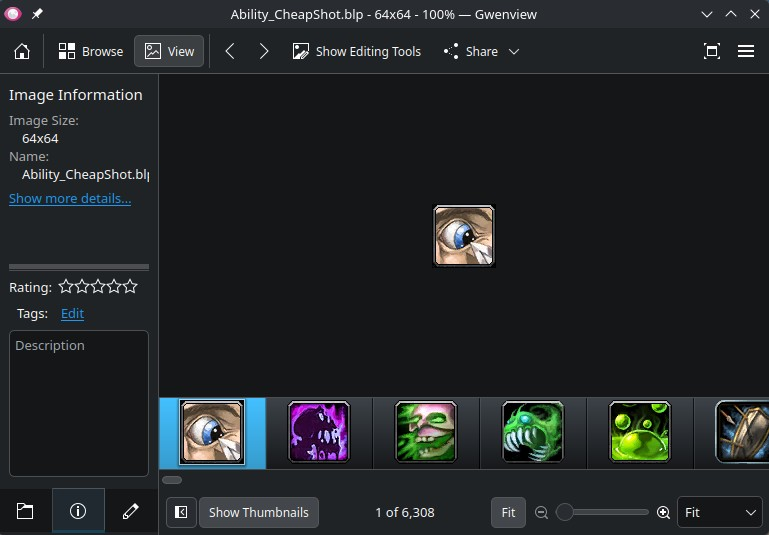

# BLP Image Format Plugin for Qt6

Qt6 plugin that adds native BLP (Blizzard Picture) file support to Gwenview and Dolphin file manager.

> **Important:** The Qt6 plugin may need to be built from source for your system. Pre-built `libblp.so` may be incompatible.




## Requirements

- **warcraft-rs** - Required for BLP conversion: `cargo install warcraft-rs`
- **Qt6 development packages** - For building the plugin
- **Linux** - Tested on Fedora 43

## Installation

1. **Install warcraft-rs**:
   ```bash
   cargo install warcraft-rs
   ```

2. **Make warcraft-rs accessible to GUI applications** (recommended):
   ```bash
   sudo ln -s ~/.cargo/bin/warcraft-rs /usr/local/bin/warcraft-rs
   ```
   This ensures the plugin can find the converter when opening files via double-click.

3. **Install Qt6 development packages**:
   - **Fedora**: `sudo dnf install qt6-qtbase-devel cmake gcc-c++`
   - **Ubuntu/Debian**: `sudo apt install qt6-base-dev cmake build-essential`

4. **Build and install the plugin** (required for your system):
   ```bash
   ./build.sh
   sudo ./install.sh
   ```

## What Gets Installed

- Qt6 Plugin → `/usr/lib64/qt6/plugins/imageformats/libblp.so` (compiled for your system)
- MIME Type → `/usr/share/mime/packages/blp-mime.xml`
- Thumbnailer → `/usr/share/thumbnailers/blp.thumbnailer`

## Usage

After installation, open BLP files like any other image:
```bash
gwenview texture.blp
```

Thumbnails appear automatically in Dolphin. If not, clear the cache:
```bash
rm -rf ~/.cache/thumbnails/*
```

## Troubleshooting

**Works from terminal but not when double-clicking:**
- Desktop environment can't find `warcraft-rs` in PATH
- Create a system symlink: `sudo ln -s ~/.cargo/bin/warcraft-rs /usr/local/bin/warcraft-rs`
- Or check logs: `journalctl -f | grep blp` while trying to open a file

**Gwenview says "Loading 'file.blp' failed":**
- Check if `warcraft-rs` is accessible: `which warcraft-rs`
- Try rebuilding: `./build.sh && sudo ./install.sh`
- View detailed logs: `QT_DEBUG_PLUGINS=1 gwenview test.blp 2>&1 | grep -i blp`

**Thumbnails not showing:**
- Clear the thumbnail cache: `rm -rf ~/.cache/thumbnails/*`
- Restart Dolphin: `killall dolphin && dolphin &`

## Uninstall

```bash
sudo ./uninstall.sh
```

```bash
cargo install warcraft-rs
```
